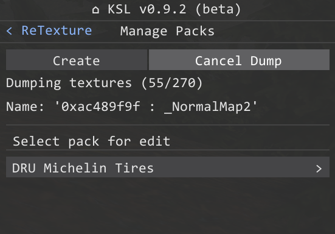
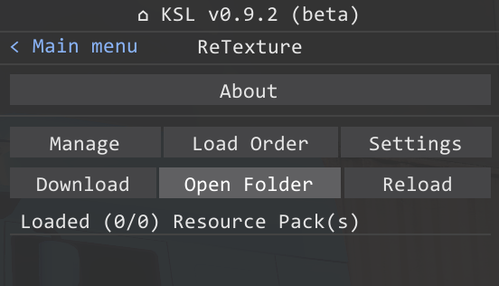

# Resource-pack dumping textures guide

## 1. Open pack manager

## 2. Click on the 'Dump Textures'

## 3. Open 'dump' folder
**Directory**: `C:\Program Files (x86)\Steam\steamapps\common\CarX Drift Racing Online\kino\mods\ReTexture\dump`

## 4. Done