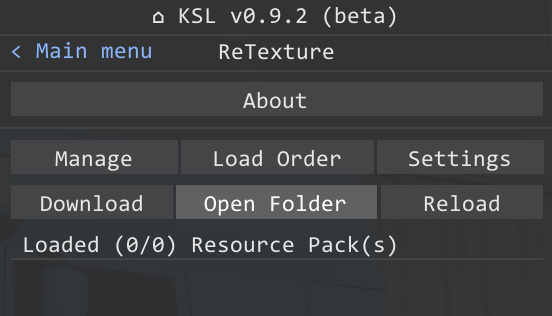

# Resource-pack installation guide

## 1. Download
> [!IMPORTANT]
> Resource packs can be found on the [**KSL platform**](https://discord.com/channels/716264804498538516/1169338345143414826)

## 2. Open 'resourcepacks' folder
**Directory**: `C:\Program Files (x86)\Steam\steamapps\common\CarX Drift Racing Online\kino\mods\ReTexture\resourcepacks`

## 3. Move a ZIP arcive to folder
> [!WARNING]
> You don't need to unpack the archive

## 4. Reload
> [!NOTE]
> If "auto-reload" is on - the resource pack will appear in the list automatically

