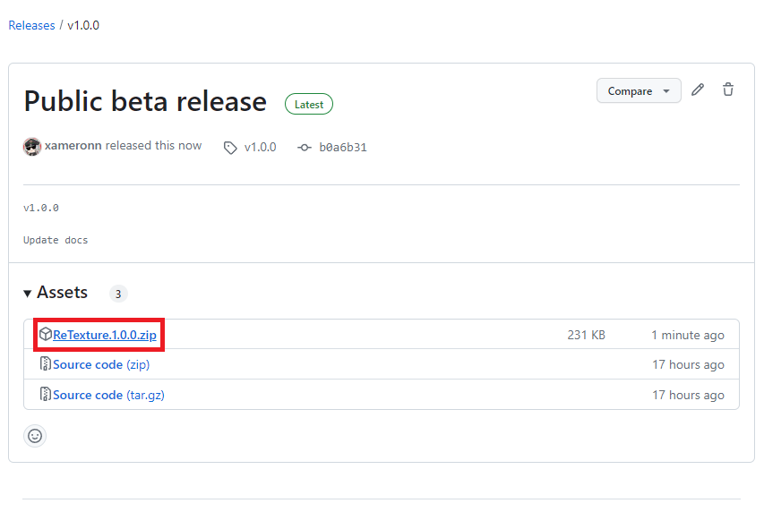
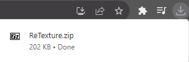
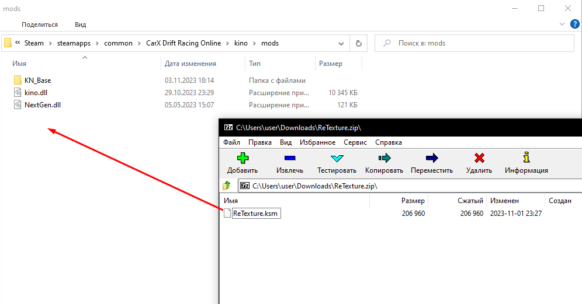

# Installation mod guide

> [!WARNING]
> Make sure you have installed the [KSL Loader](https://github.com/trbflxr/ksl/blob/master/doc/guide/install.md)

## 1. [Download latest version](https://github.com/xameronn/ReTexture/releases/latest)

## 2. Extract ZIP archive
**Directory**: `C:\Program Files (x86)\Steam\steamapps\common\CarX Drift Racing Online\kino\mods`

## 3. Done