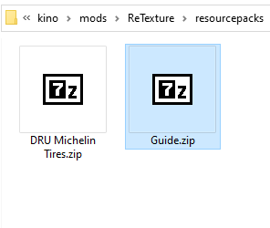

# Resource-pack manual creation guide

## 1. Create ZIP archive


## 2. Set-up structure
```
Guide.zip
├── assets/    < folder
└── pack.ini
```

## 3. Add meta data
`description` - Field is not required.

```
[meta]
name = Guide
description = Pack for guide
author = Xameron
version = 1.0.0
```

## 4. Add assets
`Asset` - This is a file of a texture (PNG, JPG, PSD), that contains links to the selected materials.

Link format: `material > property = texture.png`

```
[assets]
cartirecustomization>_TireBaseMap = ground.png
...
```

## 5. Add files
> [!WARNING]
> File structure inside of the `assets` folder can be different, specify the file path without `assets/`

Path to file: `ground.png`
```
Guide.zip
├── assets/
│   └── ground.png
└── pack.ini
```

Path to file: `tires/ground.png`
```
Guide.zip
├── assets/
│   ├── tires
│   │   └── ground.png
│   ├── sublime_2
│   │   └── ...
│   └── sublime_3
│       └── sublime_4
│           └── ...
└── pack.ini
```

## 6. Done

### Pack.ini result:
```
[meta]
name = Guide
description = Pack for guide
author = Xameron
version = 1.0.0

[assets]
cartirecustomization>_TireBaseMap = ground.png
```
