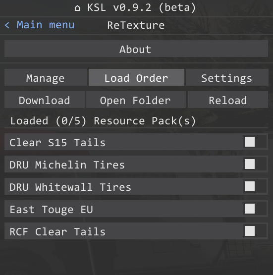
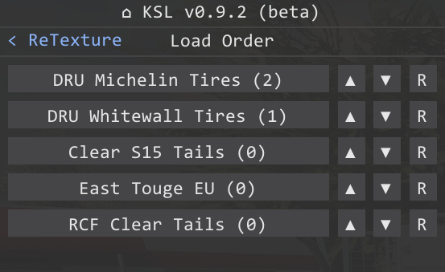

# Resource pack conflicts troubleshooting

## 1. Open load order manager

## 2. Setting resource pack priority
Set the priority for loading conflicting resource packs.
Resource packs with higher priority will not be overridden by others.

## 3. Done
