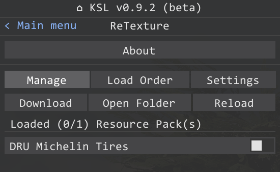
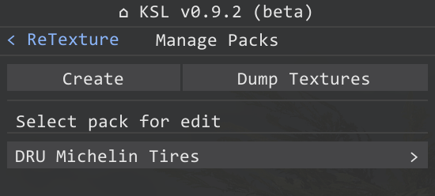
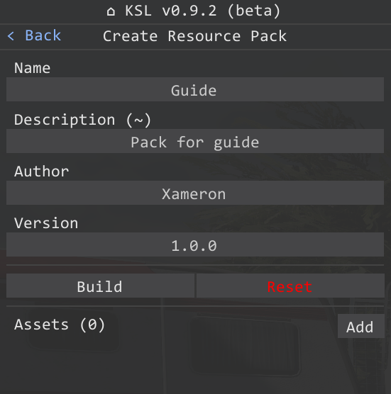
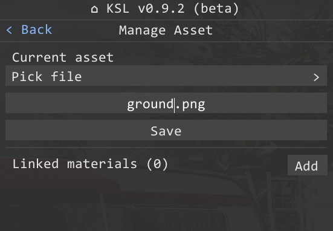
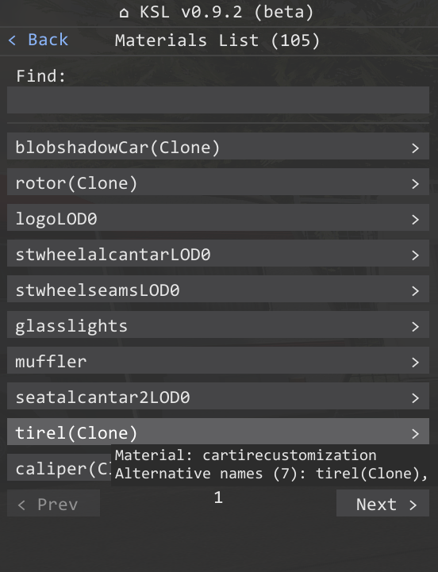
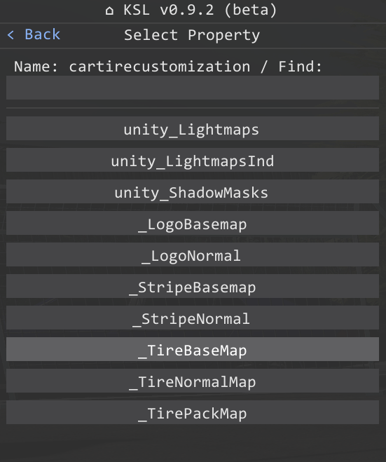
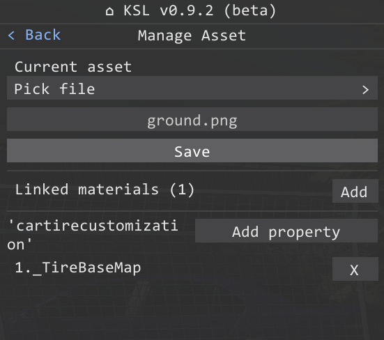
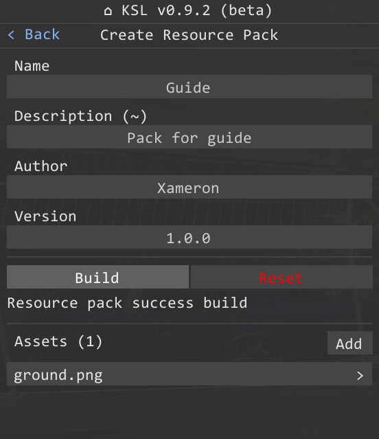

# Resource-pack UI creation guide

## 1. Open pack manager

## 2. Select pack or create new

## 3. Edit info
`~` - Field is not required.

## 4. Add assets
`Asset` - This is a file of a texture (PNG, JPG, PSD), that contains links to the selected materials.
You can select an existing file from the `kino\mods\ReTexture\dev` folder or manually specify the file name and add it after building the archive.

## 5. Link materials
> [!NOTE]
> You can assign an unlimited amount of materials and properties for each `asset`

Select a material from the object list. For convenience you can search by key words or object names.

Then specify the **property** that will be replaced.

## 6. Save asset

## 7. Build pack

## 8. Done
